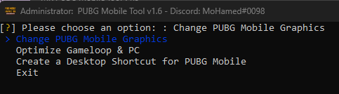

<div align="center">

<h1>MK PUBG Mobile Tool</h1>
 Gameloop تطبيق سهل الاستخدام لمحاكى <br><br>


[](https://github.com/MohamedKVIP) [](https://github.com/MohamedKVIP/MK-PUBG-Mobile-Tool/releases) [](https://github.com/MohamedKVIP/MK-PUBG-Mobile-Tool/releases) [](https://github.com/MohamedKVIP/MK-PUBG-Mobile-Tool/issues) 


[**English**](./README.md) | **العربية**
</div>

------
<br>

أداة MK PUBG Mobile هي أداة متخصصة تمكنك من تحسين تجربتك في لعبة PUBG Mobile على محاكي Gameloop على الكمبيوتر. تدعم هذه الأداة جميع إصدارات PUBG Mobile بما في ذلك:

<div dir="rtl">
<ul>
  <li>العالمية PUBG Mobile</li>
  <li>الفيتنامية PUBG Mobile</li>
  <li>التايوانية PUBG Mobile</li>
  <li>الكورية PUBG Mobile</li>
  <li>الهند Battlegrounds Mobile</li>
</ul>
<br>
<h2>الميزات</h2>
<h3>تغيير إعدادات رسومات PUBG Mobile</h3>
مع هذا الخيار، يمكنك تغيير إعدادات الرسومات في لعبة PUBG Mobile على محاكي Gameloop. لديك الخيارات التالية:


<ul>
  <li>سلس</li>
  <li>متوازن</li>
  <li>عالي الدقة</li>
  <li>HDR</li>
  <li><strong>فائق الدقة</strong></li>
</ul>
<br>
<h3>يمكنك أيضًا اختيار:</h3>
<ul>
  <li>منخفض</li>
  <li>متوسط</li>
  <li>عالي</li>
  <li>فائق</li>
  <li>60 إطارًا في الثانية</li>
  <li><strong>90 إطارًا في الثانية</strong></li>
</ul>
<br>
<h3>تحسين Gameloop والكمبيوتر</h3>

هذا الخيار يتيح لك تحسين محاكي Gameloop والكمبيوتر لتحسين الأداء أثناء لعب PUBG Mobile. لديك الخيارات التالية:


<ul>
  <li>تنظيف الملفات المؤقتة</li>
  <li>إعدادات ذكية لـ Gameloop</li>
  <li>محسن Gameloop</li>
  <li>غلق اجبارى لـ Gameloop</li>
</ul>

<br>
<h3>إنشاء اختصار سطح المكتب لـ PUBG Mobile</h3>
يتيح لك هذا الخيار إنشاء اختصار على سطح المكتب لـ PUBG Mobile، مما يجعل من السهل الوصول إلى اللعبة.

<br>
<h3>تغيير معلومات DNS</h3>

قم بتغيير إعدادات DNS بسهولة باستخدام ميزة تغيير معلومات DNS. استمتع بتجربة إنترنت أفضل ببضع نقرات فقط.

<br>
<h3>مظهر آيباد</h3>

قم بتغيير إعدادات الدقة لمحاكاة شاشة عرض تشبه آيباد بنقرة واحدة واحصل على تصميم اللعبة.

------
<h2>الاستخدام</h2>

هناك طريقتين للتشغيل.

<h3>1- التشغيل من ضغطة واحدة</h3>

لاستخدام هذه الأداة، ما عليك سوى تنزيل التطبيق من [صفحة الإصدارات (تنزيل)](https://github.com/MohamedKVIP/MK-PUBG-Mobile-Tool/releases) وتشغيله على الكمبيوتر. اتبع التعليمات على الشاشة لتغيير إعدادات الرسومات، تحسين محاكي Gameloop والكمبيوتر، أو إنشاء اختصار على سطح المكتب لـ PUBG Mobile.

<h3>2- بايثون</h3>

قم بتحميل الكود المصدرى ثم قم بتثبيت ما يلزم للتشغيل:
```shell
pip install -r requirements.txt
```
بعد اكتمال التثبيت, قم بتشغيل الأداة:
```shell
python main.py
```

<br>
<h2>لقطات الشاشة</h2>

إليك صورة لأداة MK PUBG Mobile:




<br>
<h2>ملاحظة</h2>

هذه الأداة غير مرتبطة بـ PUBG Mobile أو Gameloop. استخدمها على مسؤوليتك الشخصية.
</div>